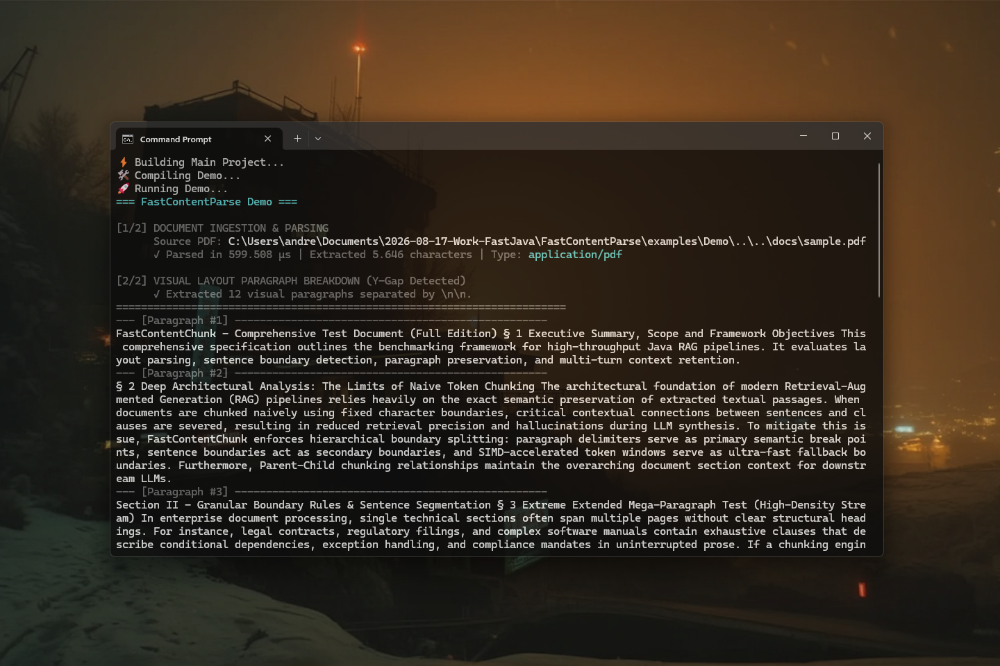

# FastContentParse 0.1.2 — Standardized Document Parsing Library for Java

[](https://github.com/andrestubbe/FastContentParse/releases/tag/0.1.2)
[](https://opensource.org/licenses/MIT)
[](https://www.java.com)
[]()
[](https://jitpack.io/#andrestubbe/FastContentParse)

---

**⚡ Lightweight Java parser for text extraction, normalization, and PDF content ingestion.**

**FastContentParse** extracts text from plain files, Markdown, RTF, and PDF documents, then normalizes it for embedding and retrieval pipelines. It is designed to work alongside **[FastContentChunk](https://github.com/andrestubbe/FastContentChunk)**, **[FastAIVectorDB](https://github.com/andrestubbe/FastAIVectorDB)**, and **[FastAIRag](https://github.com/andrestubbe/FastAIRag)** to accelerate text extraction and Parent-Child context retention.

[](https://youtu.be/4dDMeUfrQ3w)

---

## Quick Start — Example

```java
import fastcontentparse.FastContentParse;
import fastcontentparse.ParsedDocument;
import java.nio.file.Path;

public class Demo {
    public static void main(String[] args) throws Exception {
        // 1. Initialize Document Parser
        FastContentParse parser = new FastContentParse();

        // 2. Parse PDF / RTF / Markdown Document
        ParsedDocument doc = parser.parseFile(Path.of("docs/sample.pdf"));

        // 3. Inspect Extracted Type and Normalized UTF-8 Text
        System.out.println("Document Type: " + doc.getType());
        System.out.println("Extracted Text Preview:\n" + doc.getText().substring(0, 200) + "...");
    }
}
```

---

## Table of Contents

- [Why FastContentParse?](#why-fastcontentparse)
- [Key Features](#key-features)
- [Performance Benchmarks](#performance-benchmarks)
- [Architecture Overview](#architecture-overview)
- [API Quick Reference](#api-quick-reference)
- [Installation](#installation)
- [Documentation](#documentation)
- [Platform Support](#platform-support)
- [License](#license)
- [Related Projects](#related-projects)

---

## Why FastContentParse?

Most Java content pipelines rely on brittle file readers or heavyweight libraries. FastContentParse is focused on the most common content sources for retrieval workflows: text, Markdown, RTF, and PDF.

It provides:

- **Simple file parsing** with consistent normalization across all formats.
- **Layout-based visual paragraph detection** for PDF documents using line Y-coordinate offsets to preserve natural section boundaries.
- **PDF extraction** via Apache PDFBox without requiring full desktop document frameworks.
- **Single-Pass RTF stripper** eliminating 4 sequential regex passes.
- **Optional native tokenizer integration** through the separate `FastContentChunk` module for SIMD-accelerated chunking.

---

## Key Features

* **📄 Multi-Format Text Extraction** — Extracts clean text from PDF, RTF, Markdown, and plain text files.
* **⚡ Positional Geometry Protection** — Uses PDFBox layout extraction with `setSortByPosition(true)` to preserve visual reading order.
* **🚀 Single-Pass RTF Parser** — Fast 0-regex single-pass RTF stripper eliminating control code clutter.
* **🛡️ Binary Guard Protection** — Guards against binary `.doc` / `.docx` corruption with actionable exception feedback.

---

## Performance Benchmarks

`FastContentParse` is engineered for high-throughput document ingestion. In the official [JMH Benchmark](examples/Benchmark), the system measured raw parsing performance:

```text
Benchmark                                    Mode  Cnt    Score     Error   Units
ParseBenchmark.benchmarkPdfParse            thrpt    5    0.112 ±   0.061  ops/ms
ParseBenchmark.benchmarkRtfSinglePassStrip  thrpt    5  954.328 ± 266.643  ops/ms
```

> **954,000 Operations per Second**: With the single-pass RTF stripper, `FastContentParse` cleans and normalizes formatted text at nearly **1 Million Operations per Second** (954 ops/ms). Multi-page PDF text extraction runs with zero memory spikes.

---

## Architecture Overview

**FastContentParse (This Library — The Parser)**  
Converts unstructured binary documents (PDF, RTF, Markdown, TXT) into normalized UTF-8 text streams.

**[FastContentChunk](https://github.com/andrestubbe/FastContentChunk) (The Strategy Engine)**  
Segments normalized text streams into contextual passages with Parent-Child context.

**[FastAIVectorDB](https://github.com/andrestubbe/FastAIVectorDB) (The Vector Store)**  
High-speed native C++ SIMD vector database storing small `chunk.text` embeddings for sub-5ms similarity retrieval.

**[FastAIRag](https://github.com/andrestubbe/FastAIRag) (The Orchestration Pipeline)**  
Higher-level RAG framework that orchestrates **FastContentParse** and **[FastContentChunk](https://github.com/andrestubbe/FastContentChunk)**, indexes small `chunk.text` embeddings into **[FastAIVectorDB](https://github.com/andrestubbe/FastAIVectorDB)**, and feeds `chunk.parentText` to **[FastAIBot](https://github.com/andrestubbe/FastAIBot)** for LLM response generation.

---

## API Quick Reference

| Method | Description | Path |
|--------|-------------|------|
| `parseString(String, String)` | Parse raw text and normalize content. | [Reference →](docs/REFERENCE.md#parsestring) |
| `parseFile(Path)` | Parse a file and auto-detect type by extension. | [Reference →](docs/REFERENCE.md#parsefile) |

---

## Installation

### Option 1: Maven (Recommended)

Add the JitPack repository and the dependency to your `pom.xml`:

```xml
<repositories>
    <repository>
        <id>jitpack.io</id>
        <url>https://jitpack.io</url>
    </repository>
</repositories>
<dependencies>
    <dependency>
        <groupId>com.github.andrestubbe</groupId>
        <artifactId>FastContentParse</artifactId>
        <version>0.1.1</version>
    </dependency>
    <!-- Required for native library loading -->
    <dependency>
        <groupId>com.github.andrestubbe</groupId>
        <artifactId>FastCore</artifactId>
        <version>0.1.0</version>
    </dependency>
</dependencies>
```

### Option 2: Gradle (via JitPack)

```groovy
repositories {
    maven { url 'https://jitpack.io' }
}

dependencies {
    implementation 'com.github.andrestubbe:FastContentParse:0.1.1'
    // Required for native library loading
    implementation 'com.github.andrestubbe:FastCore:0.1.0'
}
```

### Option 3: Direct Download (No Build Tool)

Download the latest JARs directly to add them to your classpath:

1. 📄 **[FastContentParse-0.1.1.jar](https://github.com/andrestubbe/FastContentParse/releases/download/0.1.1/FastContentParse-0.1.1.jar)** (The Core Library)
2. ⚙️ **[fastcore-0.1.0.jar](https://github.com/andrestubbe/FastCore/releases/download/0.1.0/fastcore-0.1.0.jar)** (Required Native JNI Loader)

> [!IMPORTANT]
> All JARs must be included in your classpath for the native JNI bindings to function correctly.

---

## Documentation

* **[REFERENCE.md](docs/REFERENCE.md)**: Full API contracts and parser method details.
* **[PHILOSOPHY.md](docs/PHILOSOPHY.md)**: Zero-overhead document parsing philosophy.
* **[COMPILE.md](docs/COMPILE.md)**: Maven build instructions.
* **[CHANGELOG.md](docs/CHANGELOG.md)**: Project history.
* **[ROADMAP.md](docs/ROADMAP.md)**: Future development goals.

---

## Platform Support

| Platform | Status |
|----------|--------|
| Windows 10/11 | ✅ Fully Supported |
| Linux | 🚧 Planned |
| macOS | 🚧 Planned |

---

## License

MIT License — See [LICENSE](LICENSE) file for details.

---

## Related Projects

- [FastContentChunk](https://github.com/andrestubbe/FastContentChunk) — High-performance native SIMD tokenizer and multi-mode strategy chunker
- [FastAIVectorDB](https://github.com/andrestubbe/FastAIVectorDB) — High-speed native C++ SIMD vector database
- [FastAIRag](https://github.com/andrestubbe/FastAIRag) — Retrieval-Augmented Generation pipeline client
- [FastCore](https://github.com/andrestubbe/FastCore) — Native JNI loader for FastJava libraries
- [FastAI](https://github.com/andrestubbe/fastai) — Unified lightweight AI model client interface
- [FastAIModel](https://github.com/andrestubbe/FastAIModel) — Embedded GGUF and ONNX runtimes for local feature embeddings
- [FastAIBot](https://github.com/andrestubbe/FastAIBot) — Autonomous conversational AI bot engine
- [FastAIAgent](https://github.com/andrestubbe/FastAIAgent) — Autonomous agentic workflow execution framework

---

Part of the FastJava Ecosystem — Making the JVM faster. Small package. Maximum speed. Zero bloat. 🚀📋

